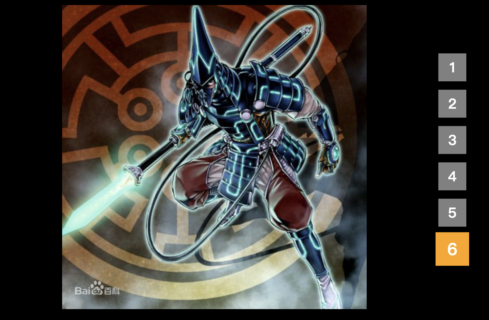

# jQuery 淡入淡出轮播图


## fadeIn() fadeout()

## setInterval
```js

            ol_lis.on('click', function() {

                ul_lis.stop().fadeOut(1000);
 
                var index = $(this).index();

                current = index;

                ul_lis.eq(index).stop().fadeIn(1000);

                $(this).addClass('clicked').siblings().removeClass('clicked');
            });


            ol_lis.eq(5).addClass('clicked');

            var current = ul_lis.length;

            var timer = setInterval(function() {

                ul_lis.stop().fadeOut();

                current--;
                ul_lis.eq(current).stop().fadeIn(1000);

                ol_lis.eq(current).addClass('clicked').siblings().removeClass('clicked');

                if (current == 0) {
                    current = ul_lis.length
                }
            }, 2000)
```

i know there still somewhere need to repair, 
i will make it perfect in a short time